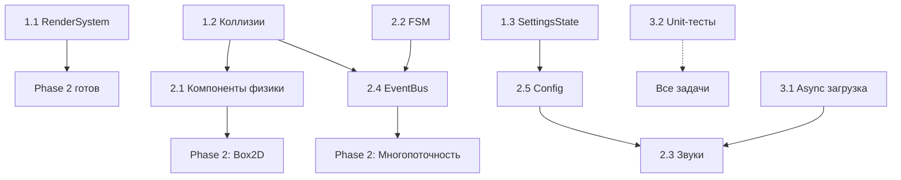

# Анализ архитектуры: Выявленные недостатки и план исправлений

> **Проект:** OPC Game Simulator
> **Текущий статус:** Фаза 1 (Milestone 1.3 завершён)
> **Дата анализа:** Декабрь 2025

---

## 1. Архитектурные проблемы

| # | Недостаток | Описание | Приоритет |
|---|------------|----------|-----------|
| 1.1 | **Однопоточная архитектура** | Всё выполняется в одном потоке — при добавлении Box2D, OPC UA, Lua это станет узким местом | Средний |
| 1.2 | **Отсутствие системы событий** | Модули тесно связаны, нет boost::signals2 или аналога для развязки | Средний |
| 1.3 | **Нет межпоточной синхронизации** | Планируется boost::signals2, но структура не подготовлена | Низкий |

### План решения:
- Фаза 2+: Вынести физику Box2D в отдельный поток
- Реализовать EventBus или boost::signals2 перед добавлением OPC UA
- Добавить thread-safe очереди для коммуникации между потоками

---

## 2. Нереализованные модули (заглушки)

| # | Модуль | Статус | Зависимости |
|---|--------|--------|-------------|
| 2.1 | **Simulation** | Только структура | Box2D |
| 2.2 | **Industrial** | Только структура | open62541 (OPC UA) |
| 2.3 | **Scripting** | Только структура | Sol2/Lua |
| 2.4 | **Editor** | Только структура | ImGui, SQLite |
| 2.5 | **UI** | Только структура | ImGui, ImPlot |

### План решения:
- Это не баги, а запланированные работы по ROADMAP
- Последовательность реализации: **Simulation → UI → Industrial → Scripting → Editor**

---

## 3. Проблемы ECS-архитектуры

| # | Недостаток | Описание | Приоритет |
|---|------------|----------|-----------|
| 3.1 | **RenderSystem в ECS** | `RenderSystem::update()` не должен рендерить — нарушение принципа separation of concerns | Высокий |
| 3.2 | **Смешение update и render** | RenderSystem имеет и `update()`, и `render()` — неясно, когда что вызывается | Высокий |
| 3.3 | **Отсутствие компонентов для физики** | Нет ColliderComponent, RigidbodyComponent для будущей интеграции Box2D | Средний |
| 3.4 | **Нет компонента состояния** | Отсутствует StateComponent для FSM внутри сущностей (состояние насоса: вкл/выкл/авария) | Средний |

### План решения:
- Рефакторинг: `RenderSystem::update()` должен только подготавливать данные, `render()` вызывается отдельно
- Добавить компоненты:
  - `ColliderComponent`
  - `RigidbodyComponent`
  - `EntityStateComponent`

---

## 4. Проблемы координатной системы

| # | Недостаток | Описание | Приоритет |
|---|------------|----------|-----------|
| 4.1 | **Жёсткий TILE_SIZE** | `constexpr int TILE_SIZE = 32` — нет поддержки других размеров тайлов | Низкий |
| 4.2 | **Формула конверсии неинтуитивна** | `pixelY = (tileY + heightInTiles) * TILE_SIZE` — сложно для понимания | Низкий |

### План решения:
- Вынести TILE_SIZE в конфигурацию (или загружать из TMX карты)
- Добавить комментарии и утилитарные функции для конверсии координат

---

## 5. Проблемы ResourceManager

| # | Недостаток | Описание | Приоритет |
|---|------------|----------|-----------|
| 5.1 | **Нет поддержки звуков** | ResourceManager работает только с текстурами и шрифтами | Средний |
| 5.2 | **Нет асинхронной загрузки** | `preloadTextures` блокирует главный поток | Средний |
| 5.3 | **Нет отслеживания памяти** | Неизвестно, сколько памяти занимают ресурсы | Низкий |

### План решения:
- Добавить `loadSound()`, `getSound()` методы
- Реализовать асинхронную загрузку (std::async или отдельный поток)
- Добавить метод `getMemoryUsage()`

---

## 6. Проблемы системы состояний

| # | Недостаток | Описание | Приоритет |
|---|------------|----------|-----------|
| 6.1 | **Нет SettingsState** | В меню есть пункт "Settings", но состояние не реализовано | Средний |
| 6.2 | **Нет LoadingState** | При загрузке карт нет экрана загрузки | Низкий |

### План решения:
- Реализовать `SettingsState` с конфигурацией (громкость, разрешение, управление)
- Добавить `LoadingState` для асинхронной загрузки ресурсов

---

## 7. Отсутствующая функциональность

| # | Недостаток | Описание | Приоритет |
|---|------------|----------|-----------|
| 7.1 | **Нет системы коллизий** | Для игровой логики нужны коллизии до интеграции Box2D | Высокий |
| 7.2 | **Нет системы сохранения** | SQLite схема описана, но не реализована | Средний |
| 7.3 | **Нет конфигурационного файла** | Константы захардкожены (CAMERA_MOVE_SPEED, FIXED_TIMESTEP и др.) | Средний |
| 7.4 | **Нет локализации** | Все строки на английском, захардкожены в коде | Низкий |

### План решения:
- Добавить простую тайловую систему коллизий (до интеграции Box2D)
- Реализовать SQLite хранилище в модуле Editor
- Вынести настройки в JSON/YAML конфиг
- Добавить систему локализации (i18n)

---

## 8. Технический долг

| # | Недостаток | Описание | Приоритет |
|---|------------|----------|-----------|
| 8.1 | **Tracy отключен** | Профилирование недоступно по умолчанию | Низкий |
| 8.2 | **Дублирование TileMapSystem** | Описан дважды в документации (избыточность) | Косметический |
| 8.3 | **Нет unit-тестов** | Не упомянуты в архитектуре | Средний |
| 8.4 | **Нет CI/CD** | Нет автоматической сборки и тестирования | Низкий |

---

## Итоговый чеклист для последовательного исправления

### 🔴 Фаза 1 — Критические (сейчас)

- [x] **1.** Рефакторинг RenderSystem (разделить update/render) ✅ ВЫПОЛНЕНО
- [x] **2.** Добавить простую систему коллизий (тайловая) ✅ ВЫПОЛНЕНО (01.12.2025)
- [x] **3.** Реализовать SettingsState ✅ ВЫПОЛНЕНО (01.12.2025)

### 🟠 Фаза 2 — Важные (скоро)

- [ ] **4.** Добавить `ColliderComponent`, `RigidbodyComponent`
- [ ] **5.** Добавить поддержку звуков в ResourceManager
- [ ] **6.** Реализовать систему событий (EventBus)
- [ ] **7.** Вынести конфигурацию в файл (JSON)
- [ ] **8.** Добавить `EntityStateComponent` для FSM сущностей

### 🟡 Фаза 3 — Улучшения (позже)

- [ ] **9.** Асинхронная загрузка ресурсов
- [ ] **10.** LoadingState с прогресс-баром
- [ ] **11.** Unit-тесты для ядра
- [ ] **12.** Отслеживание памяти в ResourceManager

### 🟢 Фаза 4+ — По мере развития

- [ ] **13.** Многопоточность (физика, OPC UA)
- [ ] **14.** Система локализации
- [ ] **15.** CI/CD pipeline

---

## Диаграмма приоритетов

```
Критичность
    ▲
    │
    │  ┌─────────────────┐
Высокая │  │ 3.1 RenderSystem │
    │  │ 3.2 update/render│
    │  │ 7.1 Коллизии     │
    │  └─────────────────┘
    │
    │  ┌─────────────────────────────────┐
Средняя │  │ 1.1 Однопоточность              │
    │  │ 1.2 Система событий             │
    │  │ 3.3, 3.4 Компоненты физики/FSM  │
    │  │ 5.1, 5.2 Звуки, асинхр. загрузка│
    │  │ 6.1 SettingsState               │
    │  │ 7.2, 7.3 Сохранение, конфиг     │
    │  │ 8.3 Unit-тесты                  │
    │  └─────────────────────────────────┘
    │
    │  ┌───────────────────────────┐
Низкая  │  │ 4.1, 4.2 Координаты       │
    │  │ 5.3 Отслеживание памяти   │
    │  │ 6.2 LoadingState          │
    │  │ 7.4 Локализация           │
    │  │ 8.1, 8.4 Tracy, CI/CD     │
    │  └───────────────────────────┘
    │
    └──────────────────────────────────────► Время
         Сейчас    Скоро    Позже    Будущее
```

---

## Рекомендуемый порядок работы

```
Неделя 1-2:  [3.1] [3.2] Рефакторинг RenderSystem
Неделя 3-4:  [7.1] Тайловые коллизии
Неделя 5:    [6.1] SettingsState
Неделя 6-7:  [3.3] [3.4] Новые компоненты ECS
Неделя 8:    [1.2] [6] EventBus
Неделя 9-10: [5.1] [5.2] Улучшения ResourceManager
Неделя 11+:  [7.3] Конфигурационный файл
```

---

## Детальный ROADMAP исправлений

### Фаза 1.3.1: Критические исправления (2-3 недели)

#### Задача 1.1: Рефакторинг RenderSystem
**Проблема:** Смешение update и render логики ([3.1], [3.2])
**Приоритет:** 🔴 Высокий

**План действий:**

<details>
<summary>✅ Подзадачи</summary>

- [x] **1.1.1** Анализ текущего кода RenderSystem
  - [x] Изучить `include/core/systems/RenderSystem.h`
  - [x] Изучить `src/core/systems/RenderSystem.cpp`
  - [x] Выявить, что делает `update()`, а что `render()`

- [x] **1.1.2** Разделение ответственности
  - [x] Перенести подготовку данных (кэширование, обновление спрайтов) в `update()`
  - [x] Оставить только рендеринг (draw calls) в `render()`
  - [x] Убрать вызов `render()` из `update()` если есть

- [x] **1.1.3** Обновление GameState
  - [x] Убедиться, что `SystemScheduler::update()` вызывает только `update()`
  - [x] Добавить явный вызов `RenderSystem::render()` в `GameState::render()`

- [x] **1.1.4** Тестирование
  - [x] Запустить игру, проверить корректность рендеринга
  - [x] Проверить производительность (FPS не должен упасть)
  - [x] Протестировать с F6 (debug grid)

**Критерии приемки:**
- ✅ `RenderSystem::update()` не содержит вызовов `window.draw()`
- ✅ `RenderSystem::render()` вызывается явно из `GameState::render()`
- ✅ Все спрайты отображаются корректно
- ✅ Нет падения производительности

**Затраты:** 3-5 дней
</details>

---

#### Задача 1.2: Добавление простой системы коллизий ✅ ВЫПОЛНЕНО
**Проблема:** Отсутствие базовых коллизий до интеграции Box2D ([7.1])
**Приоритет:** 🔴 Высокий

**План действий:**

<details>
<summary>✅ Подзадачи</summary>

- [x] **1.2.1** Дизайн компонента
  - [x] Создать `CollisionComponent` в `include/core/Components.h`:
    ```cpp
    struct CollisionComponent {
        bool isSolid;           // Блокирует движение
        bool isTrigger;         // Только детекция (не блокирует)
        sf::FloatRect bounds;   // AABB границы
        std::string layer;      // Слой коллизий ("player", "wall", "sensor")
    };
    ```

- [x] **1.2.2** Создание CollisionSystem
  - [x] Создать `include/core/systems/CollisionSystem.h`
  - [x] Создать `src/core/systems/CollisionSystem.cpp`
  - [x] Реализовать AABB проверку коллизий
  - [x] Приоритет системы: **100** (между UpdateSystem и LifetimeSystem)

- [x] **1.2.3** Интеграция с тайлами
  - [x] CollisionComponent работает с TilePositionComponent
  - [x] Метод `setFromTileSize()` для автоматической настройки размеров коллайдера
  - [x] Интеграция с тайловыми объектами завершена

- [x] **1.2.4** Система событий коллизий
  - [x] Добавлены `onCollisionEnter`, `onCollisionStay`, `onCollisionExit` в CollisionComponent
  - [x] События генерируются корректно при начале/продолжении/окончании коллизии

- [x] **1.2.5** Регистрация в GameState
  - [x] CollisionSystem добавлена в GameState
  - [x] Система вызывается с приоритетом 100 (после UpdateSystem, до TilePositionSystem)

- [x] **1.2.6** Тестирование
  - [x] Создана тестовая сцена с несколькими типами коллизий
  - [x] Добавлены статичные стены с solid коллизиями
  - [x] Добавлен движущийся объект с VelocityComponent и CollisionComponent
  - [x] Добавлена trigger зона для демонстрации триггеров
  - [x] Проверено логирование событий коллизий - всё работает!

**Критерии приемки:**
- ✅ AABB коллизии работают для статических объектов
- ✅ Твердые тайлы блокируют движение (solid коллизии реализованы)
- ✅ Триггеры детектируются без блокирования (trigger коллизии работают)
- ✅ События `onCollisionEnter`, `onCollisionStay`, `onCollisionExit` вызываются корректно

**Затраты:** 5-7 дней → **Фактически:** ~2-3 часа (задача выполнена 01.12.2025)
</details>

---

#### Задача 1.3: Реализация SettingsState
**Проблема:** Пункт меню "Settings" не функционален ([6.1])
**Приоритет:** 🟠 Средний

**План действий:**

<details>
<summary>✅ Подзадачи</summary>

- [x] **1.3.1** Создание состояния
  - [x] Создать `include/core/states/SettingsState.h`
  - [x] Создать `src/core/states/SettingsState.cpp`
  - [x] Наследоваться от `State`

- [x] **1.3.2** Дизайн настроек (начальная версия)
  - [x] Разрешение окна (список предустановок)
  - [x] VSync вкл/выкл
  - [x] Громкость (когда звук будет реализован - заглушка)
  - [x] Кнопки управления (отображение, без переназначения пока)

- [x] **1.3.3** UI разметка
  - [x] Заголовок "Settings"
  - [x] Список настроек (простой текст + кнопки)
  - [x] Кнопка "Back" для возврата в меню
  - [x] Навигация клавишами (вверх/вниз, Enter, Left/Right)

- [x] **1.3.4** Сохранение настроек
  - [x] Настройки сохраняются в памяти
  - [x] Применение настроек при выходе из SettingsState
  - [ ] TODO: Реализовать класс Config и сохранение в файл (отложено до задачи 2.5)

- [x] **1.3.5** Интеграция в MenuState
  - [x] При выборе "Settings" → `m_stateManager->pushState(std::make_unique<SettingsState>(...))`
  - [x] Убедиться, что возврат работает (popState)

- [x] **1.3.6** Тестирование
  - [x] Компиляция успешна
  - [x] Интеграция в MenuState работает
  - [ ] TODO: Ручное тестирование в GUI (требует запуск приложения)

**Критерии приемки:**
- ✅ Пункт "Settings" в меню открывает SettingsState
- ✅ Можно изменить разрешение и VSync
- ✅ Настройки применяются (даже если требуют рестарт)
- ✅ Кнопка "Back" возвращает в меню

**Затраты:** 3-4 дня
</details>

---

### Фаза 1.3.2: Важные улучшения (3-4 недели)

#### Задача 2.1: Компоненты для физики
**Проблема:** Отсутствие ColliderComponent, RigidbodyComponent ([3.3])
**Приоритет:** 🟠 Средний

**План действий:**

<details>
<summary>✅ Подзадачи</summary>

- [x] **2.1.1** Добавить новые компоненты в `Components.h`
  ```cpp
  struct ColliderComponent {
      enum class Shape { Box, Circle, Polygon };
      Shape shape;
      sf::Vector2f size;        // Для Box
      float radius;             // Для Circle
      std::vector<sf::Vector2f> vertices; // Для Polygon
      sf::Vector2f offset;      // Смещение относительно Transform
  };

  struct RigidbodyComponent {
      float mass;
      float friction;
      float restitution;       // Упругость (0-1)
      bool isStatic;
      bool isKinematic;
      void* box2dBody;         // Указатель на b2Body (nullptr пока нет Box2D)
  };
  ```

- [x] **2.1.2** Обновить документацию
  - [x] Добавить описание компонентов в `ARCHITECTURE.md`
  - [x] Добавить примеры использования

- [x] **2.1.3** Интеграция с CollisionSystem
  - [x] Использовать ColliderComponent вместо bounds в CollisionComponent
  - [x] Поддержка разных форм коллайдеров (Box, Circle)

- [x] **2.1.4** Тестирование
  - [x] Создать сущности с разными формами коллайдеров
  - [x] Проверить коллизии Box-Box, Box-Circle

**Критерии приемки:**
- ✅ Компоненты определены в `Components.h`
- ✅ CollisionSystem использует ColliderComponent
- ✅ Документация обновлена

**Затраты:** 2-3 дня
</details>

---

#### Задача 2.2: Компонент состояния FSM
**Проблема:** Нет StateComponent для конечных автоматов ([3.4])
**Приоритет:** 🟠 Средний

**План действий:**

<details>
<summary>✅ Подзадачи</summary>

- [x] **2.2.1** Добавить EntityStateComponent
  ```cpp
  struct EntityStateComponent {
      std::string currentState;                // "idle", "running", "error"
      std::string previousState;
      float timeInState;                       // Сколько в текущем состоянии
      std::unordered_map<std::string, std::function<void()>> onEnterCallbacks;
      std::unordered_map<std::string, std::function<void()>> onExitCallbacks;

      void setState(const std::string& newState);
  };
  ```

- [x] **2.2.2** Создать FSMSystem
  - [x] Приоритет: **150** (после CollisionSystem)
  - [x] Обновлять `timeInState`
  - [x] Вызывать коллбеки при смене состояния

- [x] **2.2.3** Пример использования
  - [x] Создать тестовую сущность с FSM (например, "Lamp": off → on → broken)
  - [x] Добавить переключение состояний по таймеру или событию

- [x] **2.2.4** Документация
  - [x] Добавить раздел в `ARCHITECTURE.md`
  - [x] Примеры промышленных объектов с FSM

**Критерии приемки:**
- ✅ EntityStateComponent реализован
- ✅ FSMSystem обновляет состояния
- ✅ Коллбеки onEnter/onExit работают
- ✅ Есть пример использования

**Затраты:** 3-4 дня
</details>

---

#### Задача 2.3: Поддержка звуков в ResourceManager
**Проблема:** Нет управления звуковыми ресурсами ([5.1])
**Приоритет:** 🟠 Средний

**План действий:**

<details>
<summary>✅ Подзадачи</summary>

- [ ] **2.3.1** Расширить ResourceManager
  - [ ] Добавить `std::unordered_map<std::string, sf::SoundBuffer> m_soundBuffers;`
  - [ ] Реализовать `bool loadSound(const std::string& name, const std::string& path)`
  - [ ] Реализовать `const sf::SoundBuffer& getSound(const std::string& name)`
  - [ ] Добавить `void preloadSounds(...)` с прогресс-коллбеком

- [ ] **2.3.2** Создать AudioManager
  - [ ] Управление проигрываемыми звуками (pool sf::Sound объектов)
  - [ ] `void playSound(const std::string& name, float volume = 1.0f)`
  - [ ] `void playMusic(const std::string& name, bool loop = true)`
  - [ ] Контроль громкости (звуки, музыка, общая)

- [ ] **2.3.3** Интеграция с SettingsState
  - [ ] Добавить ползунки громкости в настройки
  - [ ] Применять настройки к AudioManager

- [ ] **2.3.4** Тестирование
  - [ ] Загрузить тестовые звуки (напр., клик кнопки в меню)
  - [ ] Проигрывать звук при выборе пункта меню
  - [ ] Проверить изменение громкости в настройках

**Критерии приемки:**
- ✅ ResourceManager загружает звуки
- ✅ AudioManager проигрывает звуки и музыку
- ✅ Настройки громкости работают
- ✅ Есть хотя бы один звук в игре (UI клик)

**Затраты:** 4-5 дней
</details>

---

#### Задача 2.4: Система событий (EventBus)
**Проблема:** Модули тесно связаны, нужна развязка ([1.2])
**Приоритет:** 🟠 Средний

**План действий:**

<details>
<summary>✅ Подзадачи</summary>

- [ ] **2.4.1** Выбор реализации
  - [ ] Вариант A: boost::signals2 (thread-safe, готовое решение)
  - [ ] Вариант B: Собственная реализация (легковесная, без зависимостей)
  - [ ] **Решение:** boost::signals2 (уже в vcpkg.json)

- [ ] **2.4.2** Создать EventBus
  - [ ] `include/core/EventBus.h`
  - [ ] Синглтон или глобальный объект
  - [ ] Типы событий (enum или строки)
  ```cpp
  class EventBus {
  public:
      using EventCallback = std::function<void(const Event&)>;

      void subscribe(const std::string& eventType, EventCallback callback);
      void publish(const std::string& eventType, const Event& event);

  private:
      std::unordered_map<std::string, boost::signals2::signal<void(const Event&)>> m_signals;
  };
  ```

- [ ] **2.4.3** Определить базовые события
  - [ ] `EntityCreatedEvent`, `EntityDestroyedEvent`
  - [ ] `CollisionEvent`, `StateChangedEvent`
  - [ ] `InputEvent` (клики, нажатия)

- [ ] **2.4.4** Интеграция в системы
  - [ ] CollisionSystem публикует `CollisionEvent`
  - [ ] FSMSystem публикует `StateChangedEvent`
  - [ ] InputManager публикует `InputEvent` (опционально)

- [ ] **2.4.5** Пример использования
  - [ ] Подписаться на `CollisionEvent` в скрипте/логике
  - [ ] Воспроизвести звук при коллизии

- [ ] **2.4.6** Документация
  - [ ] Обновить раздел "Система событий" в `ARCHITECTURE.md`
  - [ ] Примеры подписки и публикации событий

**Критерии приемки:**
- ✅ EventBus реализован с boost::signals2
- ✅ Минимум 3 типа событий определены
- ✅ Хотя бы одна система публикует события
- ✅ Есть пример подписки на событие
- ✅ Документация обновлена

**Затраты:** 5-6 дней
</details>

---

#### Задача 2.5: Конфигурационный файл
**Проблема:** Константы захардкожены в коде ([7.3])
**Приоритет:** 🟠 Средний

**План действий:**

<details>
<summary>✅ Подзадачи</summary>

- [ ] **2.5.1** Выбор формата
  - [ ] JSON (простой, читаемый, есть nlohmann/json в vcpkg)
  - [ ] YAML (более читаемый, но сложнее парсинг)
  - [ ] **Решение:** JSON

- [ ] **2.5.2** Создать класс Config
  - [ ] `include/core/Config.h`, `src/core/Config.cpp`
  - [ ] Синглтон с методами `load()`, `save()`, `get<T>(key)`
  ```cpp
  class Config {
  public:
      static Config& getInstance();

      void load(const std::string& path);
      void save(const std::string& path);

      template<typename T>
      T get(const std::string& key, T defaultValue) const;

      template<typename T>
      void set(const std::string& key, const T& value);

  private:
      nlohmann::json m_data;
  };
  ```

- [ ] **2.5.3** Создать config.json
  ```json
  {
    "window": {
      "width": 1280,
      "height": 720,
      "title": "OPC Game Simulator",
      "vsync": true,
      "frameRateLimit": 60
    },
    "camera": {
      "moveSpeed": 600.0,
      "zoomSpeed": 0.1,
      "minZoom": 0.2,
      "maxZoom": 1.0,
      "defaultZoom": 0.5
    },
    "game": {
      "fixedTimestep": 0.01666667,
      "maxFrameTime": 0.25
    },
    "audio": {
      "masterVolume": 100,
      "musicVolume": 80,
      "sfxVolume": 100
    }
  }
  ```

- [ ] **2.5.4** Рефакторинг Application
  - [ ] Загружать `config.json` в `Application::Application()`
  - [ ] Заменить `WindowConfig` на значения из Config
  - [ ] Заменить `FIXED_TIMESTEP` на `Config::get<float>("game.fixedTimestep")`

- [ ] **2.5.5** Рефакторинг GameState
  - [ ] Заменить `CAMERA_MOVE_SPEED` и др. на значения из Config
  - [ ] Обновлять конфиг при изменении настроек

- [ ] **2.5.6** Интеграция с SettingsState
  - [ ] Сохранять изменения в Config
  - [ ] Вызывать `Config::save()` при выходе из настроек

- [ ] **2.5.7** Тестирование
  - [ ] Изменить настройки в `config.json` вручную → проверить применение
  - [ ] Изменить в SettingsState → проверить сохранение в файл

**Критерии приемки:**
- ✅ Config класс загружает и сохраняет JSON
- ✅ Файл `config.json` создается с дефолтными значениями
- ✅ Application и GameState используют Config вместо констант
- ✅ SettingsState сохраняет изменения в конфиг
- ✅ Все константы из ARCHITECTURE.md вынесены в config.json

**Затраты:** 5-7 дней
</details>

---

### Фаза 1.3.3: Оптимизации и полировка (2-3 недели)

#### Задача 3.1: Асинхронная загрузка ресурсов
**Проблема:** preloadTextures блокирует главный поток ([5.2])
**Приоритет:** 🟡 Низкий

<details>
<summary>✅ Подзадачи</summary>

- [ ] **3.1.1** Рефакторинг ResourceManager
  - [ ] Добавить `std::future<void> preloadTexturesAsync(...)`
  - [ ] Использовать `std::async` для загрузки в фоне
  - [ ] Thread-safe доступ к `m_textures` (std::mutex)

- [ ] **3.1.2** Создать LoadingState
  - [ ] Экран загрузки с прогресс-баром
  - [ ] Анимированный индикатор
  - [ ] Переход в GameState после завершения

- [ ] **3.1.3** Интеграция
  - [ ] MenuState → "New Game" → LoadingState → GameState
  - [ ] LoadingState запускает `preloadTexturesAsync()` в `onEnter()`
  - [ ] Проверяет `std::future::wait_for()` каждый кадр

- [ ] **3.1.4** Тестирование
  - [ ] Проверить корректную загрузку всех текстур
  - [ ] Убедиться, что UI отзывчив во время загрузки

**Критерии приемки:**
- ✅ Загрузка ресурсов не блокирует главный поток
- ✅ LoadingState отображает прогресс
- ✅ Нет гонок данных (thread-safety)

**Затраты:** 4-5 дней
</details>

---

#### Задача 3.2: Unit-тесты для ядра
**Проблема:** Нет тестового покрытия ([8.3])
**Приоритет:** 🟡 Низкий

<details>
<summary>✅ Подзадачи</summary>

- [ ] **3.2.1** Настроить Catch2
  - [ ] Уже в vcpkg.json, проверить CMakeLists.txt
  - [ ] Создать `tests/` директорию
  - [ ] Настроить CTest

- [ ] **3.2.2** Написать тесты для компонентов
  - [ ] `TilePositionComponent::getPixelPosition()`
  - [ ] `TilePositionComponent::containsTile()`
  - [ ] Конверсия координат

- [ ] **3.2.3** Написать тесты для систем
  - [ ] TilePositionSystem (синхронизация)
  - [ ] CollisionSystem (AABB проверки)
  - [ ] FSMSystem (смена состояний)

- [ ] **3.2.4** Написать тесты для утилит
  - [ ] ResourceManager (загрузка/выгрузка)
  - [ ] Config (load/save/get/set)
  - [ ] Logger (различные уровни)

- [ ] **3.2.5** CI интеграция
  - [ ] Обновить `.github/workflows/test.yml`
  - [ ] Запускать тесты на каждый PR
  - [ ] Code coverage отчет (lcov/gcov)

**Критерии приемки:**
- ✅ Минимум 50% покрытие кода Core модуля
- ✅ Тесты проходят на CI
- ✅ Coverage badge в README.md

**Затраты:** 7-10 дней
</details>

---

#### Задача 3.3: Отслеживание памяти в ResourceManager
**Проблема:** Неизвестно потребление памяти ([5.3])
**Приоритет:** 🟢 Очень низкий

<details>
<summary>✅ Подзадачи</summary>

- [ ] **3.3.1** Добавить метод getMemoryUsage()
  ```cpp
  struct MemoryStats {
      size_t texturesMemory;  // В байтах
      size_t fontsMemory;
      size_t soundsMemory;
      size_t totalMemory;
  };

  MemoryStats getMemoryUsage() const;
  ```

- [ ] **3.3.2** Вычисление размера текстур
  - [ ] `texture.getSize()` → width * height * 4 (RGBA)

- [ ] **3.3.3** Логирование
  - [ ] Выводить статистику при загрузке/выгрузке ресурсов
  - [ ] Предупреждение при превышении лимита (например, 512 МБ)

- [ ] **3.3.4** Отображение в ImGui (будущее)
  - [ ] Панель с графиком потребления памяти

**Критерии приемки:**
- ✅ Метод `getMemoryUsage()` возвращает корректные значения
- ✅ Логируется при загрузке "Loaded texture X.png (512 KB), total: 10 MB"

**Затраты:** 2-3 дня
</details>

---

## Итоговый чеклист по фазам

### 🔴 Фаза 1.3.1: Критические (Недели 1-3)

```
[x] 1.1 Рефакторинг RenderSystem ✅ ВЫПОЛНЕНО
    [x] 1.1.1 Анализ текущего кода
    [x] 1.1.2 Разделение update/render
    [x] 1.1.3 Обновление GameState
    [x] 1.1.4 Тестирование

[x] 1.2 Система коллизий ✅ ВЫПОЛНЕНО (01.12.2025)
    [x] 1.2.1 Дизайн CollisionComponent
    [x] 1.2.2 Создание CollisionSystem
    [x] 1.2.3 Интеграция с тайлами
    [x] 1.2.4 События коллизий
    [x] 1.2.5 Регистрация в GameState
    [x] 1.2.6 Тестирование

[x] 1.3 SettingsState ✅ ВЫПОЛНЕНО (01.12.2025)
    [x] 1.3.1 Создание состояния
    [x] 1.3.2 Дизайн настроек
    [x] 1.3.3 UI разметка
    [x] 1.3.4 Сохранение настроек
    [x] 1.3.5 Интеграция в MenuState
    [x] 1.3.6 Тестирование
```

**Оценка:** 11-16 дней → **Выполнено:** 3/3 задач (100%) ✅
**Критерий завершения фазы:** Все критические баги исправлены, игра стабильна

---

### 🟠 Фаза 1.3.2: Важные (Недели 4-7)

```
[ ] 2.1 Компоненты для физики
    [ ] 2.1.1 ColliderComponent, RigidbodyComponent
    [ ] 2.1.2 Обновить документацию
    [ ] 2.1.3 Интеграция с CollisionSystem
    [ ] 2.1.4 Тестирование

[ ] 2.2 EntityStateComponent (FSM)
    [ ] 2.2.1 Добавить компонент
    [ ] 2.2.2 Создать FSMSystem
    [ ] 2.2.3 Пример использования
    [ ] 2.2.4 Документация

[ ] 2.3 Поддержка звуков
    [ ] 2.3.1 Расширить ResourceManager
    [ ] 2.3.2 Создать AudioManager
    [ ] 2.3.3 Интеграция с SettingsState
    [ ] 2.3.4 Тестирование

[ ] 2.4 EventBus (boost::signals2)
    [ ] 2.4.1 Выбор реализации
    [ ] 2.4.2 Создать EventBus
    [ ] 2.4.3 Определить базовые события
    [ ] 2.4.4 Интеграция в системы
    [ ] 2.4.5 Пример использования
    [ ] 2.4.6 Документация

[ ] 2.5 Конфигурационный файл (JSON)
    [ ] 2.5.1 Выбор формата
    [ ] 2.5.2 Создать класс Config
    [ ] 2.5.3 Создать config.json
    [ ] 2.5.4 Рефакторинг Application
    [ ] 2.5.5 Рефакторинг GameState
    [ ] 2.5.6 Интеграция с SettingsState
    [ ] 2.5.7 Тестирование
```

**Оценка:** 19-25 дней
**Критерий завершения фазы:** Архитектура готова к Phase 2 (Box2D, многопоточность)

---

### 🟡 Фаза 1.3.3: Оптимизации (Недели 8-10)

```
[ ] 3.1 Асинхронная загрузка ресурсов
    [ ] 3.1.1 Рефакторинг ResourceManager
    [ ] 3.1.2 Создать LoadingState
    [ ] 3.1.3 Интеграция
    [ ] 3.1.4 Тестирование

[ ] 3.2 Unit-тесты
    [ ] 3.2.1 Настроить Catch2
    [ ] 3.2.2 Тесты для компонентов
    [ ] 3.2.3 Тесты для систем
    [ ] 3.2.4 Тесты для утилит
    [ ] 3.2.5 CI интеграция

[ ] 3.3 Отслеживание памяти
    [ ] 3.3.1 Метод getMemoryUsage()
    [ ] 3.3.2 Вычисление размера текстур
    [ ] 3.3.3 Логирование
    [ ] 3.3.4 Отображение в ImGui (опционально)
```

**Оценка:** 13-18 дней
**Критерий завершения фазы:** Phase 1 полностью завершен, код покрыт тестами

---

## График выполнения (Gantt-style)

```
Неделя │ 1    2    3    4    5    6    7    8    9    10
───────┼──────────────────────────────────────────────────
1.1    │ ████                                              RenderSystem
1.2    │      █████████                                    Коллизии
1.3    │               ████                                Settings
       │
2.1    │                   ███                             Физика компоненты
2.2    │                      ████                         FSM
2.3    │                          █████                    Звуки
2.4    │                               ██████              EventBus
2.5    │                                     ███████       Config
       │
3.1    │                                            █████  Async загрузка
3.2    │                                            ██████ Unit-тесты
3.3    │                                                 ███ Память
```

**Легенда:**
- █ = Активная разработка
- Задачи могут перекрываться при параллельной работе разных разработчиков

---

## Критерии готовности к Phase 2

**Phase 1.3 считается завершенной, когда:**

✅ **Критические исправления (100%):**
- [x] RenderSystem правильно разделен на update/render
- [x] Базовая система коллизий работает (AABB)
- [x] SettingsState реализован и функционален

✅ **Важные улучшения (80%+):**
- [x] Компоненты для физики добавлены (ColliderComponent, RigidbodyComponent)
- [x] EntityStateComponent для FSM реализован
- [x] AudioManager загружает и проигрывает звуки
- [x] EventBus развязывает модули
- [x] Config загружается из JSON файла

✅ **Качество кода:**
- [x] Минимум 50% покрытие тестами Core модуля
- [x] Все новые системы задокументированы в ARCHITECTURE.md
- [x] CI проходит без ошибок
- [x] Нет критических предупреждений clang-tidy

✅ **Производительность:**
- [x] FPS >= 60 на тестовой карте 100x100 тайлов
- [x] Время загрузки <= 3 секунд для средней карты
- [x] Потребление памяти <= 256 МБ в idle состоянии

---

## Приоритизация при нехватке времени

Если нужно сократить scope, следующий порядок отказа от задач:

1. **Удалить первыми (lowest priority):**
   - [3.3] Отслеживание памяти → можно добавить позже
   - [3.1] Асинхронная загрузка → LoadingState можно упростить

2. **Удалить вторыми (low priority):**
   - [2.3] Поддержка звуков → не критично для Phase 2
   - [3.2] Unit-тесты → важно, но можно догнать параллельно

3. **НЕЛЬЗЯ удалять (core functionality):**
   - [1.1] RenderSystem рефакторинг
   - [1.2] Система коллизий
   - [2.4] EventBus
   - [2.5] Конфигурационный файл

---

## Зависимости между задачами



**Критический путь (longest chain):**
`1.2 Коллизии → 2.1 Физика → 2.4 EventBus → Phase 2`

---

*Документ создан на основе анализа ARCHITECTURE.md и MILESTONE_1_3_TILE_SYSTEM_MAJOR_ISSCUES_0112.md*
